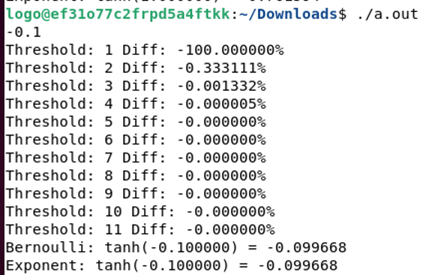

# ИДЗ №3 Овчинников Всеволод БПИ219

# Вариант #10


---
Алгоритм:


---
**Ограничения ввода:**

1) Угол в радианах n
2) Ограничения n: (|n| <= 1)
   P.S. такие ограничения установил, а не |n| < pi / 2, потому что точности C не хватает для точного просчёта
   последовательностей и погрешность очень резко повышается до значения более **0.05%**

---

#### Критерии на 4/10


- В проекте это файл `solution.c`

---


- Компиляция без отладочных опций:

```shell
gcc -O0 -masm=intel solution.c -S -o solution_1.s
```

- После компиляции создался файл `solution_1.s`, комментарии написаны в нём

---


- Использованы аргументы командой строки и ручное редактирование, получился файл `solution.s`

```shell
gcc -O0 -Wall -masm=intel -S -fno-asynchronous-unwind-tables -fverbose-asm -fcf-protection=none solution.c
```

---


- Программа скомпилирована и скомпонована без опций отладки

```shell
gcc solution_1.s -o main -lm
```

---


**Тесты**

1) Ввод:

```
0.1
```

Предполагаемый вывод:

```
Threshold: 1 Diff: 100.000000%
Threshold: 2 Diff: 0.333111%
Threshold: 3 Diff: 0.001332%
Threshold: 4 Diff: 0.000005%
Threshold: 5 Diff: 0.000000%
Threshold: 6 Diff: 0.000000%
Threshold: 7 Diff: 0.000000%
Threshold: 8 Diff: 0.000000%
Threshold: 9 Diff: 0.000000%
Threshold: 10 Diff: 0.000000%
Threshold: 11 Diff: 0.000000%
Bernoulli: tanh(0.100000) = 0.099668
Exponent: tanh(0.100000) = 0.099668
```

Вывод программы на C:


Вывод программы на GAS:


---

2) Ввод:

```
0.2
```

Предполагаемый вывод:

```
Threshold: 1 Diff: 100.000000%
Threshold: 2 Diff: 1.329791%
Threshold: 3 Diff: 0.021273%
Threshold: 4 Diff: 0.000344%
Threshold: 5 Diff: 0.000006%
Threshold: 6 Diff: 0.000000%
Threshold: 7 Diff: 0.000000%
Threshold: 8 Diff: 0.000000%
Threshold: 9 Diff: 0.000000%
Threshold: 10 Diff: 0.000000%
Threshold: 11 Diff: 0.000000%
Bernoulli: tanh(0.200000) = 0.197375
Exponent: tanh(0.200000) = 0.197375
```

Вывод программы на C:


Вывод программы на GAS:


---

3) Ввод:

```
0.3
```

Предполагаемый вывод:

```
Threshold: 1 Diff: 100.000000%
Threshold: 2 Diff: 2.982153%
Threshold: 3 Diff: 0.107312%
Threshold: 4 Diff: 0.003909%
Threshold: 5 Diff: 0.000143%
Threshold: 6 Diff: 0.000005%
Threshold: 7 Diff: 0.000000%
Threshold: 8 Diff: 0.000000%
Threshold: 9 Diff: 0.000000%
Threshold: 10 Diff: 0.000000%
Threshold: 11 Diff: 0.000000%
Bernoulli: tanh(0.300000) = 0.291313
Exponent: tanh(0.300000) = 0.291313
```

Вывод программы на C:


Вывод программы на GAS:


---

4) Ввод:

```
0.4
```

Предполагаемый вывод:

```
Threshold: 1 Diff: 100.000000%
Threshold: 2 Diff: 5.277298%
Threshold: 3 Diff: 0.337492%
Threshold: 4 Diff: 0.021855%
Threshold: 5 Diff: 0.001417%
Threshold: 6 Diff: 0.000092%
Threshold: 7 Diff: 0.000006%
Threshold: 8 Diff: 0.000000%
Threshold: 9 Diff: 0.000000%
Threshold: 10 Diff: 0.000000%
Threshold: 11 Diff: 0.000000%
Bernoulli: tanh(0.400000) = 0.379949
Exponent: tanh(0.400000) = 0.379949
```

Вывод программы на C:


Вывод программы на GAS:


---

5) Ввод:

```
1
```

Предполагаемый вывод:

```
Threshold: 1 Diff: 100.000000%
Threshold: 2 Diff: 31.303529%
Threshold: 3 Diff: 12.464314%
Threshold: 4 Diff: 5.042823%
Threshold: 5 Diff: 2.043399%
Threshold: 6 Diff: 0.828142%
Threshold: 7 Diff: 0.335632%
Threshold: 8 Diff: 0.136027%
Threshold: 9 Diff: 0.055130%
Threshold: 10 Diff: 0.022343%
Threshold: 11 Diff: 0.024952%
Bernoulli: tanh(1.000000) = 0.761784
Exponent: tanh(1.000000) = 0.761594
```

Вывод программы на C:


Вывод программы на GAS:


---

6) Ввод:

```
-0.1
```

Предполагаемый вывод:

```
Threshold: 1 Diff: -100.000000%
Threshold: 2 Diff: -0.333111%
Threshold: 3 Diff: -0.001332%
Threshold: 4 Diff: -0.000005%
Threshold: 5 Diff: -0.000000%
Threshold: 6 Diff: -0.000000%
Threshold: 7 Diff: -0.000000%
Threshold: 8 Diff: -0.000000%
Threshold: 9 Diff: -0.000000%
Threshold: 10 Diff: -0.000000%
Threshold: 11 Diff: -0.000000%
Bernoulli: tanh(-0.100000) = -0.099668
Exponent: tanh(-0.100000) = -0.099668
```

Вывод программы на C:



Вывод программы на GAS:


---

7) Ввод:

```
-0.9
```

Предполагаемый вывод:

```
Threshold: 1 Diff: -100.000000%
Threshold: 2 Diff: -25.646053%
Threshold: 3 Diff: -8.278381%
Threshold: 4 Diff: -2.713135%
Threshold: 5 Diff: -0.890512%
Threshold: 6 Diff: -0.292332%
Threshold: 7 Diff: -0.095967%
Threshold: 8 Diff: -0.031504%
Threshold: 9 Diff: -0.010342%
Threshold: 10 Diff: -0.003395%
Threshold: 11 Diff: -0.003770%
Bernoulli: tanh(-0.900000) = -0.716325
Exponent: tanh(-0.900000) = -0.716298
```

Вывод программы на C:


Вывод программы на GAS:


---


- Отчёт сформирован.

---

#### Критерии на 5/10


- Функции с передачей данных через параметры использованы `solution.c`

```c
long double bernoulliNumber(int n);
long long factorial(int n);
long double tanhNumber(long double angle, int threshold);
```

---


- Локальные переменные использованы(Например, `angle`, `maxThreshold`, `threshold` в функции **main** и `result`, `n`
  , `n2` в функции tanhNumber). Это можно увидеть в файле `solution.c`

```c
long double angle;
int maxThreshold = 11;
int threshold = 1;
long double result = 0;
int n = 1;
int n2 = n * 2;
```

---


- В ассемблерную программу при вызове функции добавлены комментарии, описывающие передачу фактических параметров и
  перенос возвращаемого результата. Это можно увидеть в файле `solution.s`

---


- В функциях для формальных параметров добавлены комментарии, описывающие связь между параметрами языка Си и
  регистрами (стеком). Это можно увидеть в фале `solution.s`

---


- Информация добавлена в отчёт